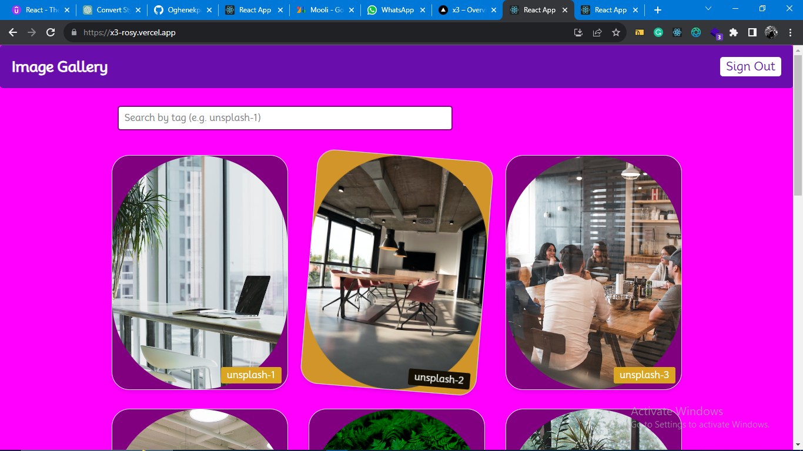
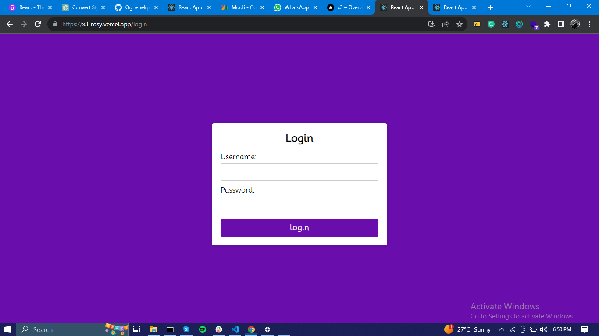

# Drag-and-Drop Image gallery using React

<!-- 
 -->

<div style="display: flex; align-items: center;">
  
  
</div>

- [Objective](#objective)
- [Features](#features)
  - [Authentication](#1-Authentication)
  - [Image-Display](#2-Image-Display)
  - [Loading-state](#3-Loading-state)
  - [Search-Functionality](#4-Search-Functionality)
  - [ Drag-and-Drop](#5-Search-Functionality)
  - [ Drag-and-Drop](#6-Responsive Design)
- [Technologies Used](#technologies-used)
- [Screenshot](#screenshot)
- [Getting Started](#getting-started)
  - [Prerequisites](#prerequisites)
  - [Installation](#installation)
- [Usage](#usage)

## Objective

implementing a fully functional and responsive image gallery that showcases a collection of images in a visually appealing way.
A user should be able to Login to the gallery page. Authenticated users should be able to use the Drag-and-Drop feature, they should be able to select and drag images, effortlessly rearranging them within the gallery.

## Features

### 1. Authentication

- UserName: user@example.com
- Password: 1Password

### 2. Image-Display

- Displayed a grid layout that showcases a collection of images presented in a visually appealing manner with consistent spacing and sizing, and a a tag to each image.

### 3. Loading-state

- added a loading state for when images are not ready for display (used a populae NIgerian slang `sope otilo and otiloing(invented by me)`)

### 4. Search-Functionality

- integrated a search field that filters the image list based on the tags added to the images.

### 5. Drag-and-Drop:

- Integrated the ability for users to drag and drop images within the gallery with `react-beautiful-dnd-grid`.

### 6. Responsive Design:

- Ensured that the gallery is responsive and functions seamlessly on different devices, including mobile phones, tablets, and desktops.

## Technologies Used

This project was developed using the following technologies:

- React.
- react-beautiful-dnd-grid.
- My own custom Authentication for login in.

## Getting Started

Follow these instructions to get a copy of the project up and running on your local machine.

### Perequisites

This project was bootstrapped with [Create React App](https://github.com/facebook/create-react-app).

### Installation

1. Clone the repository:

   ```bash
   git clone https://github.com/Oghenekparobo/x3
   ```

2. Navigate to the project directory:

```
cd x3

```

3. Install project dependencies:

```
npm install
```

### Usage

To run the project locally, use the following command:

```
npm start
```

Runs the app in the development mode.
Open [http://localhost:3000](http://localhost:3000) to view it in the browser.

The page will reload if you make edits.\
You will also see any lint errors in the console.

Builds the app for production to the `build` folder.\
It correctly bundles React in production mode and optimizes the build for the best performance.
